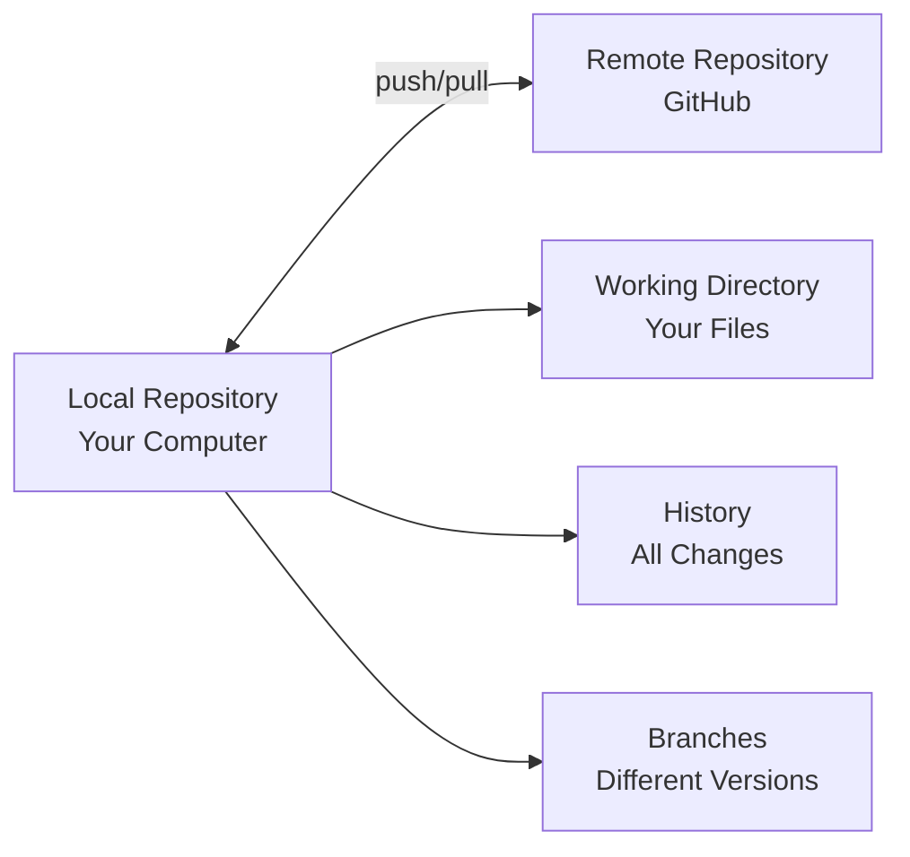
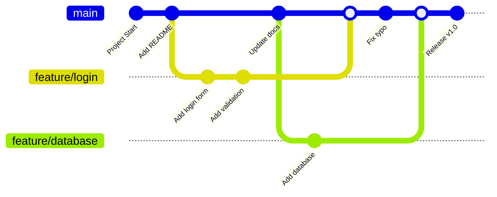
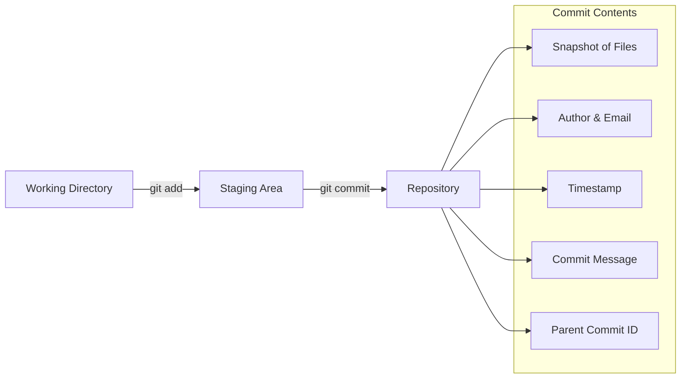
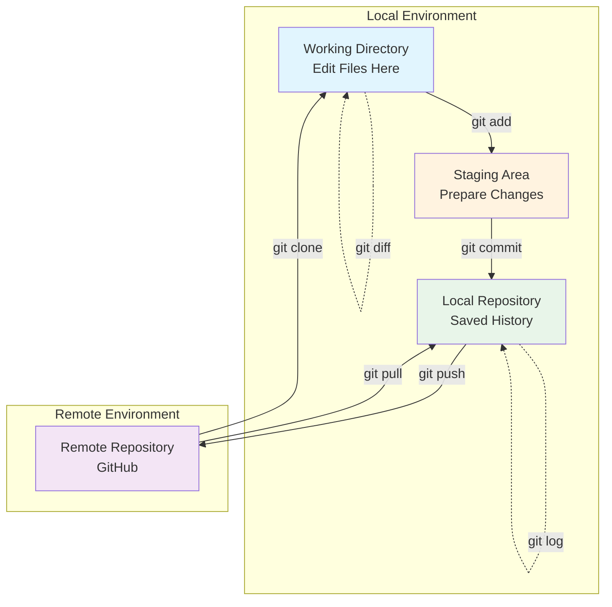
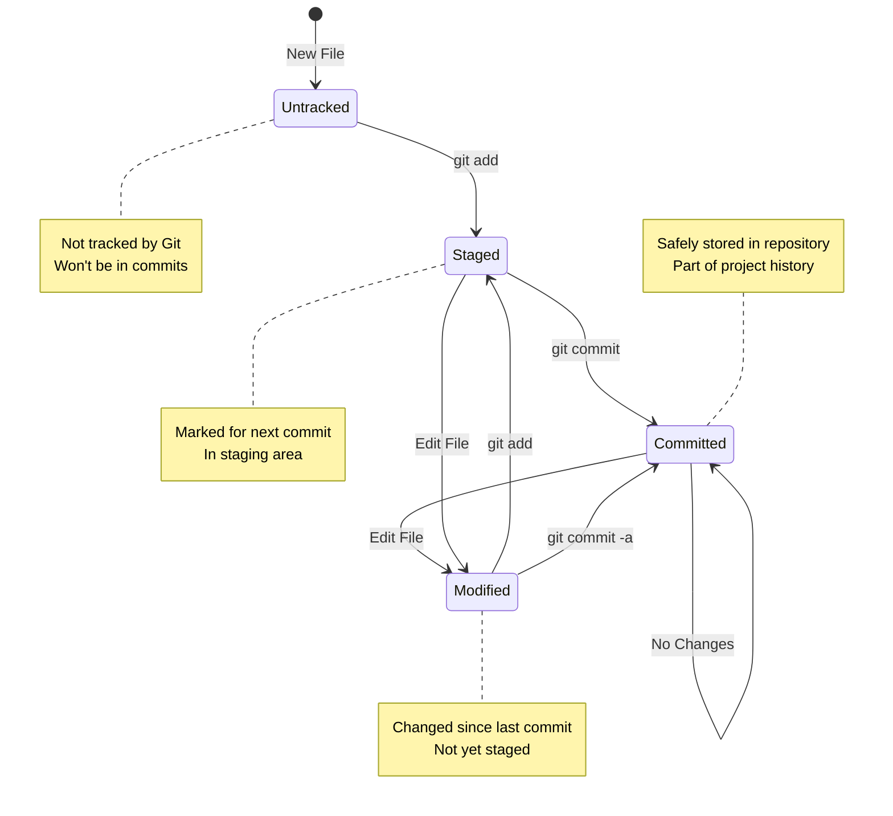
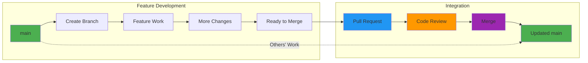
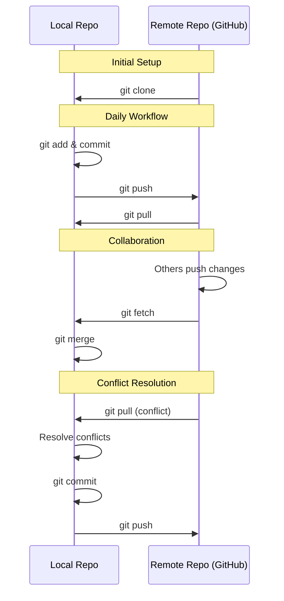

# Core Concepts

[✓] Quick Start → [✓] Overview → [●] Concepts → [ ] Setup → [ ] Workflow → [ ] Practice → [ ] Reference

## Mental Models

Understanding these core concepts will help you navigate Git and collaborative development effectively. Each concept builds on the previous one, creating a complete mental framework.

### Repository as Project Container

Think of a repository like a smart filing cabinet that never forgets. Unlike a regular folder on your computer, a repository remembers every change ever made to every file. It's your project's home base, containing not just the current state of your files, but their entire history.

When you create a repository, Git adds a hidden `.git` folder that acts like the filing cabinet's memory. This folder stores snapshots of your project at different points in time, who made changes, when they were made, and why. You can travel back to any point in your project's history, see what changed between versions, or even restore deleted files.

Repositories can exist in multiple places simultaneously. Your local repository on your computer is where you do your work. The remote repository (often on GitHub) is where you share your work with others. These repositories stay synchronized through push and pull operations, ensuring everyone has access to the latest changes.

### Branches as Parallel Universes

Branches are one of Git's most powerful features. Imagine your project as a tree - the trunk is your main branch, and you can grow new branches for different features or experiments. Each branch is like a parallel universe where you can make changes without affecting other branches.

When you create a branch, you're creating a safe space to work. You can experiment freely, make mistakes, try different approaches, all without disturbing the stable main branch. Your teammates can work on their own branches simultaneously, and Git keeps track of all these parallel development streams.

The magic happens when you merge branches. Git intelligently combines the changes from different branches, allowing multiple people to work on the same project without stepping on each other's toes. If two people change the same part of a file, Git will flag it as a conflict for human review, ensuring nothing gets lost or overwritten accidentally.

### Commits as Snapshots

A commit is like taking a photograph of your project at a specific moment. Just as a photo captures what everyone looked like at a family gathering, a commit captures the exact state of every file in your project. But commits are even better than photos - they also record who took the snapshot, when it was taken, and include a note explaining what changed and why.

Each commit is connected to the commits before it, creating a timeline of your project's evolution. This chain of commits tells the story of your project - how it started, how it grew, what problems were solved, and what features were added. You can step through this timeline commit by commit, seeing exactly how your project evolved.

Commits are permanent and immutable. Once you create a commit, it's preserved forever in your repository's history. This permanence is a feature, not a bug - it means you can always go back to see what your project looked like at any point in time, recover lost work, or understand why certain decisions were made.

## Essential Terminology

**Branch** - An independent line of development. Like a parallel universe for your code.
*See also: Checkout, Merge*

**Cherry-pick** - Apply specific commits from one branch to another. Like copying select changes.
*See also: Commit, Merge*

**Checkout** - Switch between branches or restore files. Your way to navigate different versions.
*See also: Branch, Switch*

**Clone** - Create a local copy of a remote repository. Your first step in contributing.
*See also: Fork, Remote*

**Commit** - Save a snapshot of changes with a descriptive message. The building block of history.
*See also: Stage, Push*

**Diff** - View differences between files, commits, or branches. Shows what changed.
*See also: Status, Log*

**Fork** - Create your own copy of someone else's repository. Start of open-source contribution.
*See also: Clone, Pull Request*

**HEAD** - Pointer to the current commit/branch you're working on. Where you are right now.
*See also: Checkout, Branch*

**Local** - Files and repository on your computer. Where you do your work.
*See also: Remote, Push*

**Merge** - Combine changes from different branches. Bringing work together.
*See also: Branch, Pull Request*

**Origin** - The default name for your remote repository. Your project's home base.
*See also: Remote, Clone*

**Pull** - Download and integrate changes from remote. Getting updates from others.
*See also: Fetch, Push*

**Pull Request (PR)** - Propose changes for review before merging. Collaborative code review.
*See also: Merge, Branch*

**Push** - Upload your local commits to remote repository. Sharing your work.
*See also: Pull, Commit*

**Rebase** - Reapply commits on top of another branch. Alternative to merge.
*See also: Merge, Branch*

**Remote** - Repository hosted online (e.g., GitHub). Where teams collaborate.
*See also: Origin, Local*

**Repository (Repo)** - Project folder with version control. Contains all files and history.
*See also: Clone, Init*

**Stage** - Mark changes to include in next commit. Preparing your snapshot.
*See also: Add, Commit*

**Stash** - Temporarily save uncommitted changes. Clean workspace without losing work.
*See also: Commit, Checkout*

**Tag** - Mark specific commits as important (e.g., releases). Permanent bookmarks.
*See also: Commit, Release*

## Concept Mapping

Understanding how Git concepts relate to each other is crucial for effective version control. This section visualizes the relationships and workflows.

### The Complete Git Workflow

### File States in Git

Every file in your repository exists in one of several states. Understanding these states helps you know what Git is tracking and what will be included in your next commit.

### Branching and Merging Flow

### Local vs Remote Synchronization

## Putting It All Together

These concepts work together to create a powerful system for managing code:

1. **Start**: Clone a repository to get a local copy
2. **Branch**: Create a feature branch for your work  
3. **Work**: Make changes in your working directory
4. **Stage**: Add changes to the staging area
5. **Commit**: Save snapshots to your local repository
6. **Push**: Share your branch with the team
7. **Collaborate**: Create a pull request for review
8. **Integrate**: Merge approved changes to main
9. **Sync**: Pull latest changes from teammates
10. **Repeat**: Continue the development cycle

Each concept supports the others, creating a robust workflow that scales from solo projects to massive team collaborations.

## Next Steps

Now that you understand the core concepts and terminology, let's [set up your environment](setup.md) and put these ideas into practice →

---

*Remember: These concepts will become second nature with practice. Focus on understanding the ideas, not memorizing every detail.*