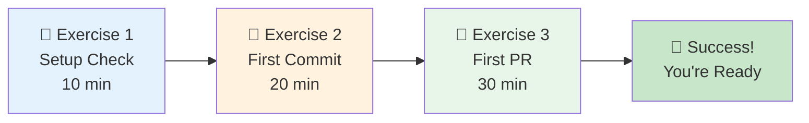

# Practice Exercises

<div class="progress-tracker">
<span class="completed">[✓] Quick Start</span> → <span class="completed">[✓] Overview</span> → <span class="completed">[✓] Concepts</span> → <span class="completed">[✓] Setup</span> → <span class="completed">[✓] Workflow</span> → <span class="current">[●] Practice</span> → <span class="upcoming">[ ] Reference</span>
</div>

## Welcome to Hands-On Practice! 🚀

These exercises will help you apply everything you've learned. Each exercise builds on the previous one, gradually increasing in complexity. By the end, you'll have real experience with the complete Git workflow.



## Exercise 1: Environment Validation 🔧

### Overview

**🎯 Learning Objectives:**
- Verify all tools are properly installed
- Understand your development environment
- Practice basic Git commands
- Troubleshoot common setup issues

**⏱️ Time:** 10 minutes  
**📚 Prerequisites:** Completed [Setup](setup.md) page  
**🏆 Difficulty:** Beginner

### Part A: Tool Verification

Let's ensure your development environment is ready for action!

**📋 Tasks:**

- [ ] Open your terminal (PowerShell/Terminal/Command Prompt)
- [ ] Navigate to the project directory
- [ ] Run verification commands
- [ ] Activate virtual environment
- [ ] Check Python packages

??? info "💡 Need help with terminal?"
    **Windows:** 
    - Open Start Menu → Type "PowerShell" → Right-click → Run as Administrator
    - Or: `Win + X` → Windows PowerShell (Admin)
    
    **macOS:** 
    - `Cmd + Space` → Type "Terminal" → Enter
    - Or: Applications → Utilities → Terminal
    
    **Linux:** 
    - `Ctrl + Alt + T`
    - Or: Applications → Terminal

#### Step 1: Navigate to Project

```bash
# Change to your projects directory
cd ~/projects/py-project-tmpl

# Verify you're in the right place
pwd
# Expected: /home/username/projects/py-project-tmpl (or similar)

# List files to confirm
ls
# Expected: README.md, pyproject.toml, src/, docs/, etc.
```

#### Step 2: Check Git Installation

```bash
# Check Git version
git --version
```

**✅ Expected Output:**
```
git version 2.40.0 (or higher)
```

**❌ If you see "command not found":**
- Return to [Setup](setup.md) and install Git
- Restart your terminal after installation

#### Step 3: Check Python Installation

```bash
# Check Python version
python --version
# Or on some systems:
python3 --version
```

**✅ Expected Output:**
```
Python 3.10.0 (or higher)
```

#### Step 4: Check UV Package Manager

```bash
# Check UV version
uv --version
```

**✅ Expected Output:**
```
uv 0.4.0 (or higher)
```

#### Step 5: Activate Virtual Environment

=== "Windows"
    ```powershell
    # Activate virtual environment
    .venv\Scripts\activate
    
    # Your prompt should change to show (.venv)
    # (.venv) PS C:\projects\py-project-tmpl>
    ```

=== "macOS/Linux"
    ```bash
    # Activate virtual environment
    source .venv/bin/activate
    
    # Your prompt should change to show (.venv)
    # (.venv) username@computer:~/projects/py-project-tmpl$
    ```

??? warning "⚠️ Virtual environment not found?"
    Create it first:
    ```bash
    uv venv
    ```
    Then try activating again.

#### Step 6: Verify Python Packages

```bash
# List installed packages
uv pip list

# Check specific important packages
python -c "import mkdocs; print(f'MkDocs {mkdocs.__version__}')"
```

**✅ Expected:** List includes mkdocs, mkdocs-material, and other packages

### Part B: Git Configuration Check

Let's verify Git is properly configured with your identity.

**📋 Tasks:**

- [ ] Check Git user configuration
- [ ] Verify email configuration
- [ ] Review Git settings
- [ ] Test Git functionality

#### Step 1: Check Your Identity

```bash
# Check your name
git config --global user.name

# Check your email
git config --global user.email

# See all Git configuration
git config --global --list
```

**✅ Expected Output:**
- Your full name
- Your email address
- Various Git settings

**❌ If name or email is missing:**
```bash
git config --global user.name "Your Name"
git config --global user.email "your.email@example.com"
```

### Part C: Create a Test File

Let's practice creating and tracking a file with Git.

**📋 Tasks:**

- [ ] Create a test file
- [ ] Check Git status
- [ ] Stage the file
- [ ] Unstage the file
- [ ] Clean up

#### Step 1: Create Test File

```bash
# Create a simple test file
echo "# Test Exercise File" > test_exercise.md
echo "This is a practice file for learning Git." >> test_exercise.md

# Verify it was created
cat test_exercise.md
```

#### Step 2: Check Git Status

```bash
# See what Git thinks about this new file
git status
```

**✅ Expected Output:**
```
On branch main
Untracked files:
  (use "git add <file>..." to include in what will be committed)
        test_exercise.md
```

#### Step 3: Practice Staging

```bash
# Stage the file
git add test_exercise.md

# Check status again
git status
```

**✅ Expected:** File now appears under "Changes to be committed"

```bash
# Unstage the file
git restore --staged test_exercise.md

# Verify it's unstaged
git status
```

#### Step 4: Clean Up

```bash
# Remove the test file
rm test_exercise.md

# Verify it's gone
git status
# Expected: "nothing to commit, working tree clean"
```

### 🎯 Self-Assessment

Answer these questions to check your understanding:

??? question "What does `git status` tell you?"
    It shows:
    - Current branch
    - Staged changes (ready to commit)
    - Unstaged changes (modified but not staged)
    - Untracked files (new files Git doesn't know about)

??? question "What's the difference between staged and unstaged?"
    - **Staged**: Changes marked to be included in next commit
    - **Unstaged**: Changes made but not yet marked for commit
    - Only staged changes are saved when you commit

??? question "Why activate the virtual environment?"
    - Isolates project dependencies
    - Prevents conflicts with system Python
    - Ensures everyone uses same package versions
    - Required for running project code

### ✅ Exercise 1 Complete!

**🎉 Congratulations!** You've verified your environment is properly set up.

**Key Takeaways:**
- ✓ All tools installed and working
- ✓ Git configured with your identity
- ✓ Virtual environment activated
- ✓ Basic Git commands practiced

**Common Issues Resolved:**
- Command not found → Tool not installed or not in PATH
- Permission denied → Need admin rights or wrong directory
- Virtual env issues → Create with `uv venv` first

---

## Exercise 2: Your First Real Commit 📝

### Overview

**🎯 Learning Objectives:**
- Create meaningful changes to a project
- Practice the stage-commit workflow
- Write professional commit messages
- Explore Git history

**⏱️ Time:** 20 minutes  
**📚 Prerequisites:** Completed Exercise 1  
**🏆 Difficulty:** Beginner-Intermediate

### The Scenario

You've joined the team and noticed the project is missing a helpful utility script. You'll add a Python script that displays project information - a real contribution that helps other developers!

### Part A: Create Your Branch

**📋 Tasks:**

- [ ] Ensure you're on main branch
- [ ] Pull latest changes
- [ ] Create feature branch
- [ ] Verify branch creation

#### Step 1: Start Fresh

```bash
# Make sure you're on main
git checkout main

# Get latest changes
git pull origin main

# See current branch
git branch
# The * shows current branch
```

#### Step 2: Create Feature Branch

```bash
# Create and switch to new branch
git checkout -b feature/add-project-info-script

# Verify you're on the new branch
git branch
```

**✅ Expected Output:**
```
  main
* feature/add-project-info-script
```

### Part B: Create the Utility Script

Let's create a useful script that displays project information.

**📋 Tasks:**

- [ ] Create utils directory
- [ ] Write the script
- [ ] Make it executable
- [ ] Test the script

#### Step 1: Create Directory Structure

```bash
# Create a utils directory if it doesn't exist
mkdir -p utils

# Navigate to it
cd utils
```

#### Step 2: Create the Script

Create `utils/project_info.py`:

```python
#!/usr/bin/env python3
"""
Project Information Utility

Displays useful information about the Python project template.
Created as part of the Git learning exercises.
"""

import sys
import platform
from pathlib import Path


def display_project_info():
    """Display project information and system details."""
    print("=" * 50)
    print("Python Project Template - Information Utility")
    print("=" * 50)
    
    # Project details
    project_root = Path(__file__).parent.parent
    print(f"\n📁 Project Location: {project_root}")
    
    # Python information
    print(f"\n🐍 Python Version: {sys.version.split()[0]}")
    print(f"📍 Python Path: {sys.executable}")
    
    # System information
    print(f"\n💻 Operating System: {platform.system()}")
    print(f"🏗️  Platform: {platform.platform()}")
    
    # Git information (if available)
    git_dir = project_root / ".git"
    if git_dir.exists():
        print(f"\n🔀 Git Repository: ✓ Initialized")
        
        # Try to read current branch
        head_file = git_dir / "HEAD"
        if head_file.exists():
            with open(head_file, 'r') as f:
                ref = f.read().strip()
                if ref.startswith('ref: refs/heads/'):
                    branch = ref.replace('ref: refs/heads/', '')
                    print(f"🌿 Current Branch: {branch}")
    else:
        print(f"\n🔀 Git Repository: ✗ Not found")
    
    # Project files
    print("\n📄 Key Project Files:")
    important_files = ['README.md', 'pyproject.toml', '.gitignore']
    for file in important_files:
        file_path = project_root / file
        status = "✓" if file_path.exists() else "✗"
        print(f"   {status} {file}")
    
    print("\n" + "=" * 50)
    print("ℹ️  Tip: Run this script anytime to check your setup!")
    print("=" * 50)


if __name__ == "__main__":
    display_project_info()
```

??? info "💡 Understanding the script"
    This script:
    - Shows project location
    - Displays Python version and path
    - Shows system information
    - Checks if Git is initialized
    - Lists important project files
    - Provides helpful tips

#### Step 3: Test the Script

```bash
# Return to project root
cd ..

# Run the script
python utils/project_info.py
```

**✅ Expected:** See project information displayed nicely

### Part C: Stage and Commit Your Work

Now let's properly commit this new feature.

**📋 Tasks:**

- [ ] Review changes
- [ ] Stage the new file
- [ ] Write meaningful commit message
- [ ] Make the commit

#### Step 1: Review What Changed

```bash
# See all changes
git status

# See actual file content that will be added
git diff
# (Note: new files need --cached after staging)
```

#### Step 2: Stage the Changes

```bash
# Stage the new script
git add utils/project_info.py

# Verify staging
git status
```

**✅ Expected:** File appears under "Changes to be committed"

#### Step 3: Write Commit Message

```bash
# Commit with a descriptive message
git commit -m "feat: Add project information utility script

- Create utils/project_info.py script
- Display Python, system, and Git information  
- Show project file status
- Help developers verify their environment

This utility assists new contributors in understanding
the project setup and verifying their environment."
```

??? info "💡 Commit message best practices"
    **Format:**
    ```
    type: Brief description (50 chars max)
    
    - Detailed point 1
    - Detailed point 2
    
    Longer explanation if needed.
    ```
    
    **Types:**
    - `feat:` New feature
    - `fix:` Bug fix
    - `docs:` Documentation
    - `test:` Testing
    - `refactor:` Code restructuring

### Part D: Make Additional Improvements

Let's practice making multiple commits by adding a README for the utils directory.

**📋 Tasks:**

- [ ] Create utils README
- [ ] Make second commit
- [ ] View commit history

#### Step 1: Create Utils README

Create `utils/README.md`:

```markdown
# Utility Scripts

This directory contains helpful utility scripts for the Python project template.

## Available Scripts

### project_info.py
Displays comprehensive information about your project setup.

**Usage:**
```bash
python utils/project_info.py
```

**Features:**
- Shows project location and structure
- Displays Python version and path
- System information
- Git repository status
- Verifies important project files

## Adding New Utilities

When adding new utility scripts:
1. Create descriptive script names
2. Include docstrings
3. Add usage instructions here
4. Test thoroughly before committing

---
*Created during Git workflow learning exercises*
```

#### Step 2: Stage and Commit

```bash
# Stage the README
git add utils/README.md

# Commit with message
git commit -m "docs: Add README for utils directory

- Document project_info.py usage
- Provide guidelines for adding new utilities
- Include usage examples"
```

#### Step 3: View Your History

```bash
# See commit history
git log --oneline -5

# See detailed view of last commit
git show

# See all changes in this branch
git log main..HEAD
```

### Part E: Prepare for Sharing

**📋 Tasks:**

- [ ] Review all changes
- [ ] Check commit quality
- [ ] Prepare for push

#### Step 1: Final Review

```bash
# See all commits in this branch
git log --oneline main..feature/add-project-info-script

# Review the complete diff
git diff main...HEAD

# Ensure working directory is clean
git status
```

### 🎯 Self-Assessment

??? question "Why create a feature branch?"
    - Isolates your work from main branch
    - Allows experimentation without breaking stable code
    - Makes collaboration easier
    - Enables easy rollback if needed

??? question "What makes a good commit?"
    - Single logical change
    - Clear, descriptive message
    - Passes tests (if any)
    - Includes related changes together
    - Excludes unrelated changes

??? question "Why multiple commits instead of one big commit?"
    - Easier to review
    - Better history tracking
    - Simpler to revert specific changes
    - Clearer documentation of progress

### ✅ Exercise 2 Complete!

**🎉 Excellent work!** You've created a real contribution to the project.

**Key Achievements:**
- ✓ Created a feature branch
- ✓ Added useful functionality
- ✓ Made multiple meaningful commits
- ✓ Practiced commit message best practices
- ✓ Explored Git history commands

**Skills Practiced:**
- Branch creation and switching
- File creation and editing
- Staging and committing
- Commit message writing
- History exploration

---

## Exercise 3: Your First Pull Request 🚀

### Overview

**🎯 Learning Objectives:**
- Push your branch to GitHub
- Create a professional pull request
- Understand the review process
- Practice collaboration workflow

**⏱️ Time:** 30 minutes  
**📚 Prerequisites:** Completed Exercise 2  
**🏆 Difficulty:** Intermediate

### The Scenario

You've created a valuable utility script and documentation. Now it's time to share your work with the team by creating your first pull request!

### Part A: Push to Remote

**📋 Tasks:**

- [ ] Verify branch status
- [ ] Push branch to GitHub
- [ ] Confirm successful push

#### Step 1: Pre-Push Checklist

```bash
# Confirm you're on feature branch
git branch
# Should show: * feature/add-project-info-script

# Check nothing uncommitted
git status
# Should show: nothing to commit, working tree clean

# See what will be pushed
git log origin/main..HEAD --oneline
```

#### Step 2: Push Your Branch

```bash
# Push branch to remote (first time)
git push -u origin feature/add-project-info-script
```

**✅ Expected Output:**
```
Enumerating objects: 7, done.
Counting objects: 100% (7/7), done.
...
To https://github.com/pahansen95/py-project-tmpl.git
 * [new branch]      feature/add-project-info-script -> feature/add-project-info-script
Branch 'feature/add-project-info-script' set up to track remote branch...
```

??? warning "⚠️ Push rejected?"
    If you see "rejected" error:
    ```bash
    # Fetch latest changes
    git fetch origin
    
    # Rebase your branch
    git rebase origin/main
    
    # Try push again
    git push -u origin feature/add-project-info-script
    ```

### Part B: Create Pull Request

**📋 Tasks:**

- [ ] Navigate to GitHub
- [ ] Start pull request
- [ ] Write PR description
- [ ] Submit for review

#### Step 1: Open Pull Request Page

1. Visit the repository on GitHub
2. You should see a yellow banner: "feature/add-project-info-script had recent pushes"
3. Click "Compare & pull request"

**Alternative method:**
1. Click "Pull requests" tab
2. Click "New pull request"
3. Select your branch in "compare" dropdown

#### Step 2: Craft Your PR Title

**Title:** Add project information utility script

??? info "💡 Good PR titles"
    - Clear and concise
    - Start with verb (Add, Fix, Update, Remove)
    - Describe what, not how
    - No period at end
    
    **Good examples:**
    - ✅ Add user authentication system
    - ✅ Fix memory leak in data processor
    - ✅ Update dependencies to latest versions
    
    **Bad examples:**
    - ❌ Changes
    - ❌ Fixed stuff
    - ❌ work in progress

#### Step 3: Write PR Description

Use this template for your PR description:

```markdown
## Summary

This PR adds a utility script that helps developers quickly verify their project setup and environment configuration. The script provides essential information about Python, system, Git, and project status in one convenient command.

## What Changed

- ✨ Added `utils/project_info.py` script that displays:
  - Project location and structure
  - Python version and installation path
  - Operating system information
  - Git repository status and current branch
  - Verification of key project files

- 📚 Added `utils/README.md` with:
  - Documentation for the utility script
  - Usage instructions
  - Guidelines for adding new utilities

## Why This Is Useful

New contributors often need to verify their environment setup. This script provides a quick way to:
- Confirm Python installation
- Check Git configuration
- Verify project structure
- Troubleshoot setup issues

## How to Test

1. Check out this branch
2. Run the utility script:
   ```bash
   python utils/project_info.py
   ```
3. Verify it displays correct information about your setup

## Screenshots

<details>
<summary>Example Output</summary>

```
==================================================
Python Project Template - Information Utility
==================================================

📁 Project Location: /home/user/projects/py-project-tmpl

🐍 Python Version: 3.11.0
📍 Python Path: /home/user/.venv/bin/python

💻 Operating System: Linux
🏗️  Platform: Linux-5.15.0-generic-x86_64

🔀 Git Repository: ✓ Initialized
🌿 Current Branch: feature/add-project-info-script

📄 Key Project Files:
   ✓ README.md
   ✓ pyproject.toml
   ✓ .gitignore

==================================================
ℹ️  Tip: Run this script anytime to check your setup!
==================================================
```

</details>

## Checklist

- [x] Code follows project style guidelines
- [x] Added appropriate documentation
- [x] Tested locally
- [x] No debug code or print statements
- [x] Commit messages follow conventions

## Related Issues

First contribution - no related issues.

---

This is my first contribution as part of learning the Git workflow! 🎉
```

#### Step 4: Add Metadata

Before creating the PR:

1. **Labels** (if you have permission):
   - `enhancement`
   - `good first issue`
   - `documentation`

2. **Reviewers** (if you have permission):
   - Skip for practice
   - In real projects, add team members

3. **Projects/Milestones**:
   - Skip for practice

#### Step 5: Create the Pull Request

1. Review everything one more time
2. Click "Create pull request" button
3. You'll be taken to your PR page

### Part C: Understanding PR Interface

**📋 Tasks:**

- [ ] Explore PR tabs
- [ ] Understand status checks
- [ ] Review the diff
- [ ] Check PR number

#### Key Areas to Explore:

1. **Conversation Tab**
   - Main discussion thread
   - Review comments appear here
   - Status updates shown

2. **Commits Tab**
   - List of all commits
   - Click to see individual changes

3. **Files Changed Tab**
   - Complete diff of all changes
   - Where code review happens
   - Can add comments to specific lines

4. **Checks Tab**
   - Automated tests (if configured)
   - Build status
   - Code quality checks

### Part D: Simulate Review Process

While you can't review your own PR in a real scenario, let's understand what happens next.

**📋 What typically happens:**

- [ ] Automated checks run
- [ ] Team members review code
- [ ] Feedback provided
- [ ] Changes requested/approved
- [ ] Final merge

#### Common Review Feedback Examples:

??? example "Example: Suggestion"
    **Reviewer:** "Great addition! Could you add error handling for when the script is run outside the project directory?"
    
    **Your response:** 
    - Acknowledge the feedback
    - Make the change
    - Push new commit
    - Reply when done

??? example "Example: Question"
    **Reviewer:** "Why did you choose to use pathlib instead of os.path?"
    
    **Your response:**
    - Explain your reasoning
    - Be open to alternatives
    - Change if team prefers different approach

??? example "Example: Approval"
    **Reviewer:** "LGTM! (Looks Good To Me) Nice clean implementation."
    
    **Your response:**
    - Thank the reviewer
    - Wait for merge approval

### Part E: Next Steps (Don't Actually Do)

In a real project, after approval:

1. **Merge the PR**
   - Usually "Squash and merge" for features
   - Confirms merge commit message
   - Deletes branch after merge

2. **Post-Merge Cleanup**
   ```bash
   # Switch back to main
   git checkout main
   
   # Pull the merged changes
   git pull origin main
   
   # Delete local feature branch
   git branch -d feature/add-project-info-script
   ```

### 🎯 Self-Assessment

??? question "What makes a good PR?"
    - Clear, descriptive title
    - Comprehensive description
    - Reasonable size (not too big)
    - All tests passing
    - Responds to feedback promptly
    - Follows project conventions

??? question "Why is code review important?"
    - Catches bugs early
    - Shares knowledge
    - Maintains code quality
    - Improves team collaboration
    - Documents decisions

??? question "What should you do if changes are requested?"
    1. Read feedback carefully
    2. Ask questions if unclear
    3. Make requested changes
    4. Push new commits
    5. Reply to comments
    6. Request re-review

### ✅ Exercise 3 Complete!

**🎉 Congratulations!** You've completed your first pull request!

**Key Achievements:**
- ✓ Pushed branch to remote
- ✓ Created professional PR
- ✓ Wrote comprehensive description
- ✓ Understood review process
- ✓ Practiced full workflow

**Real-World Skills Gained:**
- Remote branch management
- PR creation and description
- Code review understanding
- Professional communication
- Collaboration workflow

---

## 🏆 All Exercises Complete!

### Your Accomplishments

You've successfully completed all three exercises and gained hands-on experience with:

1. **Environment Setup & Validation**
   - Verified all tools working
   - Configured Git properly
   - Tested basic commands

2. **Making Meaningful Commits**
   - Created feature branches
   - Added real functionality
   - Wrote professional commit messages
   - Managed multiple commits

3. **Collaboration Workflow**
   - Pushed to remote repository
   - Created pull requests
   - Understood review process
   - Practiced team workflow

### 🎓 Certificate of Completion

```
╔══════════════════════════════════════════════════════╗
║                                                      ║
║          🎉 CERTIFICATE OF COMPLETION 🎉             ║
║                                                      ║
║  This certifies that you have successfully          ║
║  completed the Git Workflow Practice Exercises       ║
║                                                      ║
║  Skills Demonstrated:                                ║
║  ✓ Git Fundamentals                                 ║
║  ✓ Branch Management                                ║
║  ✓ Commit Best Practices                            ║
║  ✓ Pull Request Creation                            ║
║  ✓ Collaboration Workflow                           ║
║                                                      ║
║  You are now ready to contribute to real projects!  ║
║                                                      ║
║  Date: ________________                             ║
║                                                      ║
╚══════════════════════════════════════════════════════╝
```

### 🚀 What's Next?

#### Immediate Next Steps:

1. **Apply Your Skills**
   - Find a "good first issue" in the project
   - Create a real contribution
   - Help other newcomers

2. **Deepen Your Knowledge**
   - Explore advanced Git features
   - Learn about rebasing
   - Understand merge strategies

3. **Practice More**
   - Contribute to open source
   - Work on team projects
   - Experiment with Git features

#### Recommended Challenges:

**🌟 Beginner Challenges:**
- Fix a typo in documentation
- Add a helpful comment to code
- Improve error messages

**⭐ Intermediate Challenges:**
- Add a new utility script
- Improve test coverage
- Refactor existing code

**💫 Advanced Challenges:**
- Implement new feature
- Optimize performance
- Design new architecture

### 📚 Additional Resources

#### Continue Learning:
- [Pro Git Book](https://git-scm.com/book) - Free comprehensive guide
- [GitHub Skills](https://skills.github.com/) - Interactive courses
- [Learn Git Branching](https://learngitbranching.js.org/) - Visual tutorial

#### Quick References:
- [Git Cheat Sheet](https://education.github.com/git-cheat-sheet-education.pdf)
- [GitHub Flow Guide](https://guides.github.com/introduction/flow/)
- [Conventional Commits](https://www.conventionalcommits.org/)

### 🤝 Join the Community

- **Ask Questions**: Don't hesitate to ask in discussions
- **Share Knowledge**: Help others who are learning
- **Contribute**: Every contribution matters
- **Stay Connected**: Follow project updates

### Final Tips

1. **Practice Regularly** - Use Git daily to build muscle memory
2. **Read Others' Code** - Review PRs to learn from others
3. **Ask Questions** - No question is too simple
4. **Make Mistakes** - They're the best teachers
5. **Stay Curious** - Always explore new features

---

## Thank You! 🙏

Thank you for completing these exercises. You've taken an important step in your development journey. Remember:

> *"Every expert was once a beginner. Every pro was once an amateur. Every icon was once an iconoclast. And every legend was once an unheard of person who refused to give up."* - Robin Sharma

**You're now equipped with the skills to contribute meaningfully to any Git-based project. Welcome to the community of developers!**

🎉 **Happy Coding!** 🎉

---

*Remember: The [Quick Reference](reference.md) page is always available when you need command reminders or troubleshooting help.*