# Development Workflow

<div class="progress-tracker">
<span class="completed">[✓] Quick Start</span> → <span class="completed">[✓] Overview</span> → <span class="completed">[✓] Concepts</span> → <span class="completed">[✓] Setup</span> → <span class="current">[●] Workflow</span> → <span class="upcoming">[ ] Practice</span> → <span class="upcoming">[ ] Reference</span>
</div>

## Workflow Overview

The Git workflow is a cycle that repeats for every feature, bug fix, or change you make. Understanding this flow is key to effective collaboration.

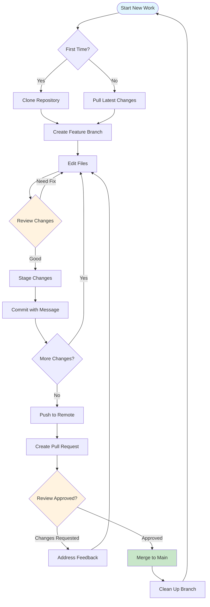

## Step 1: Getting Started

Every development task begins with ensuring you have the latest code and creating a dedicated space for your changes.

### Understanding the Starting Point

Before you begin, you need to understand where you're starting from. Are you contributing to an existing project for the first time, or returning to continue work? This determines your first step.

**Key Concepts:**
- **Repository**: Your project's complete history and files
- **Clone**: Creating your first local copy
- **Pull**: Updating an existing local copy
- **Branch**: Your isolated workspace for changes

### Clone the Repository (First Time Only)

When joining a project, your first step is to create a local copy of the repository.

=== "GitHub Desktop"
    
    1. **From GitHub.com:**
       - Navigate to the repository page
       - Click green "Code" button
       - Select "Open with GitHub Desktop"
    
    2. **From GitHub Desktop:**
       - File → Clone Repository
       - Search for `pahansen95/py-project-tmpl`
       - Choose local folder (e.g., `~/projects`)
       - Click "Clone"
    
    **Success Indicators:**
    - Repository appears in GitHub Desktop
    - Files visible in chosen folder
    - Current branch shows as `main`

=== "Command Line"
    
    ```bash
    # Navigate to your projects folder
    cd ~/projects
    
    # Clone with HTTPS (easier)
    git clone https://github.com/pahansen95/py-project-tmpl.git
    
    # Or clone with SSH (if configured)
    git clone git@github.com:pahansen95/py-project-tmpl.git
    
    # Enter the project
    cd py-project-tmpl
    
    # Verify the clone
    git status
    ```
    
    **Success Indicators:**
    - "Cloning into 'py-project-tmpl'..." message
    - Files downloaded to local folder
    - `git status` shows "On branch main"

=== "VS Code"
    
    1. **Command Palette Method:**
       - Press `Ctrl+Shift+P` (Cmd+Shift+P on Mac)
       - Type "Git: Clone"
       - Enter: `https://github.com/pahansen95/py-project-tmpl.git`
       - Select folder location
       - Open in current or new window
    
    2. **Welcome Screen Method:**
       - Click "Clone Git Repository..."
       - Follow same steps as above
    
    **Success Indicators:**
    - VS Code opens with project files
    - Source Control panel shows repository
    - Bottom left shows branch name

### Update Your Local Copy (Returning to Work)

Before starting new work, always sync with the latest changes from the team.

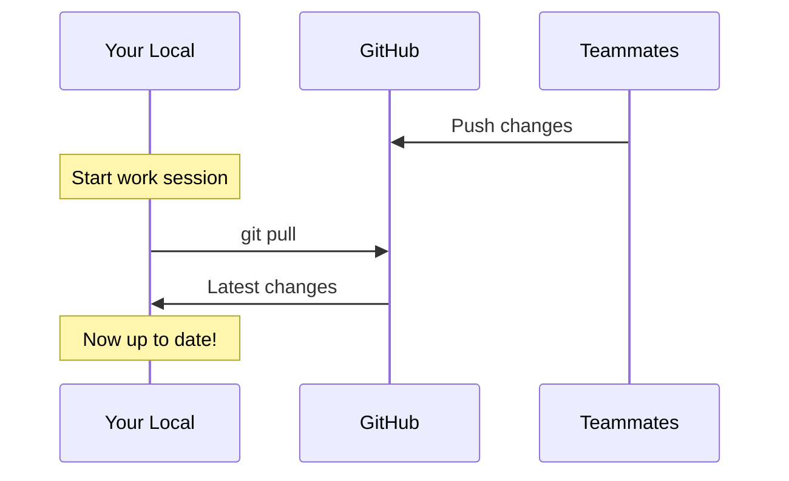

=== "GitHub Desktop"
    
    1. Open repository in GitHub Desktop
    2. Click "Fetch origin" button
    3. If changes found, click "Pull origin"
    4. Review the updated files list
    
    **Pro Tip**: Enable automatic fetching in preferences

=== "Command Line"
    
    ```bash
    # Always start from main branch
    git checkout main
    
    # Get latest changes
    git pull origin main
    
    # See what changed
    git log --oneline -10
    ```
    
    **Pro Tip**: Use `git fetch` to preview changes without merging

=== "VS Code"
    
    1. Open Source Control panel (`Ctrl+Shift+G`)
    2. Click sync button (circular arrows)
    3. Or click "..." → Pull
    4. Check notification for update count
    
    **Pro Tip**: Enable auto-fetch in settings

### Create a Feature Branch

Every piece of work should happen in its own branch. This keeps the main branch stable and your work isolated.

**Branch Naming Conventions:**
- Features: `feature/user-authentication`
- Bug fixes: `fix/login-error`
- Documentation: `docs/api-guide`
- Experiments: `experiment/new-algorithm`

=== "GitHub Desktop"
    
    1. Click "Current Branch" dropdown
    2. Click "New Branch" button
    3. Enter descriptive name:
       - Good: `feature/add-user-profile`
       - Bad: `my-branch` or `fix`
    4. Ensure "based on main" is selected
    5. Click "Create Branch"
    
    The branch is created locally and you're automatically switched to it.

=== "Command Line"
    
    ```bash
    # Create and switch to new branch
    git checkout -b feature/add-user-profile
    
    # Verify you're on the new branch
    git branch
    # * feature/add-user-profile
    #   main
    ```
    
    **Alternative approach:**
    ```bash
    # Create branch without switching
    git branch feature/add-user-profile
    
    # Then switch to it
    git checkout feature/add-user-profile
    ```

=== "VS Code"
    
    1. Click branch name in bottom-left
    2. Select "Create new branch..."
    3. Enter branch name
    4. Press Enter
    
    Or use Command Palette:
    - `Ctrl+Shift+P` → "Git: Create Branch"

**Success Indicators:**
- ✅ Branch name appears in your tool
- ✅ No uncommitted changes from main
- ✅ Ready to start making changes

## Step 2: Making Changes

This is where you do your actual work - writing code, fixing bugs, or updating documentation.

### The Development Cycle

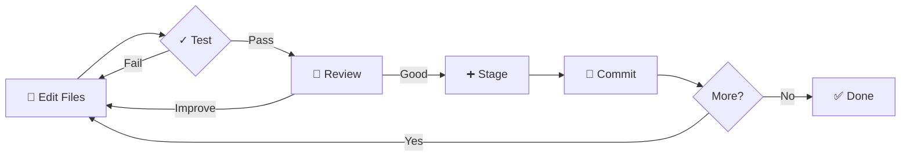

### Edit Files

Make your changes using your favorite editor. Keep changes focused and related to your branch's purpose.

**Best Practices:**
- One feature per branch
- Keep changes small and focused
- Test as you go
- Save frequently

### Understanding File States

After editing, your files exist in different states:

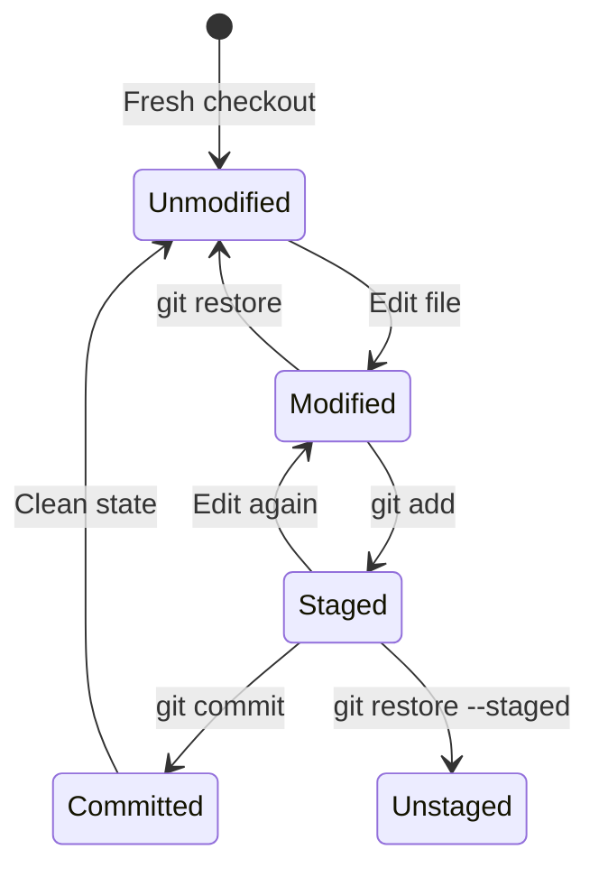

### Review Your Changes

Always review what you've changed before committing. This helps catch mistakes and ensures you're committing what you intend.

=== "GitHub Desktop"
    
    **Changes Tab shows:**
    - List of modified files
    - Visual diff for each file
    - Lines added (green) and removed (red)
    
    **Review checklist:**
    - [ ] No debug code left in
    - [ ] No sensitive information
    - [ ] Changes match branch purpose
    - [ ] No unintended files

=== "Command Line"
    
    ```bash
    # See what files changed
    git status
    
    # See actual changes
    git diff
    
    # See changes for specific file
    git diff src/main.py
    
    # See changes with word-level detail
    git diff --word-diff
    ```
    
    **Pro commands:**
    ```bash
    # See staged changes
    git diff --staged
    
    # Summary of changes
    git diff --stat
    ```

=== "VS Code"
    
    **Source Control Panel:**
    - Shows all changed files
    - Click file to see diff
    - 'M' = modified, 'U' = untracked, 'D' = deleted
    
    **Timeline View:**
    - Shows file history
    - Compare with previous versions
    
    **GitLens Features:**
    - Inline blame information
    - File history exploration

### Stage Your Changes

Staging lets you choose exactly what goes into your commit. You can stage all changes or select specific files.

=== "GitHub Desktop"
    
    **To stage files:**
    - Check boxes next to files to include
    - Or check top box to select all
    - Uncheck files to exclude
    
    **Partial staging:**
    - Click on specific lines in diff
    - Blue highlighting shows selection
    - Only selected lines will be committed

=== "Command Line"
    
    ```bash
    # Stage specific files
    git add src/feature.py
    git add tests/test_feature.py
    
    # Stage all changes
    git add .
    
    # Stage with interactive selection
    git add -p
    # y = stage this hunk
    # n = don't stage
    # s = split into smaller hunks
    ```
    
    **Unstaging:**
    ```bash
    # Unstage specific file
    git restore --staged file.py
    
    # Unstage everything
    git reset
    ```

=== "VS Code"
    
    **Stage files:**
    - Click '+' next to file name
    - Or stage all with '+' in Changes header
    
    **Stage portions:**
    - Open file diff
    - Select lines to stage
    - Right-click → "Stage Selected Ranges"
    
    **Unstage:**
    - Click '-' next to staged file

### Commit Your Changes

A commit saves a snapshot of your staged changes with a descriptive message explaining what and why.

**Commit Message Best Practices:**

```
type: Brief description (50 chars max)

Longer explanation if needed. Explain what changed and why,
not how (the code shows how). Wrap at 72 characters.

- Bullet points for multiple changes
- Reference issue numbers: Fixes #123
```

**Common Types:**
- `feat:` New feature
- `fix:` Bug fix
- `docs:` Documentation only
- `style:` Formatting, no code change
- `refactor:` Code restructuring
- `test:` Adding tests
- `chore:` Maintenance tasks

=== "GitHub Desktop"
    
    1. Review staged changes one more time
    2. Enter commit summary (required):
       - `fix: Resolve login timeout issue`
    3. Add description (optional but recommended):
       - Explain why the change was needed
       - Reference issues or discussions
    4. Click "Commit to [branch-name]"
    
    **Good Examples:**
    - ✅ `feat: Add password reset functionality`
    - ✅ `fix: Prevent crash when user email is empty`
    - ✅ `docs: Update API examples for v2 endpoints`
    
    **Bad Examples:**
    - ❌ `fix bug`
    - ❌ `updates`
    - ❌ `asdfasdf`

=== "Command Line"
    
    ```bash
    # Simple commit
    git commit -m "feat: Add user profile page"
    
    # Commit with description
    git commit -m "fix: Resolve database connection timeout" \
                -m "Increased timeout from 5s to 30s to handle slow networks"
    
    # Open editor for longer message
    git commit
    
    # Add all changes and commit
    git commit -am "docs: Update installation guide"
    ```
    
    **Amending commits (before push):**
    ```bash
    # Fix last commit message
    git commit --amend -m "Better message"
    
    # Add forgotten file to last commit
    git add forgotten_file.py
    git commit --amend --no-edit
    ```

=== "VS Code"
    
    1. Enter message in commit input box
    2. Use `Ctrl+Enter` to commit
    3. Or click checkmark button
    
    **For longer messages:**
    - Click pencil icon for full editor
    - First line: summary
    - Blank line
    - Details in following lines
    
    **Extensions:**
    - Conventional Commits helper
    - Commit message templates

### Making Multiple Commits

Break your work into logical commits. Each commit should represent one complete change.

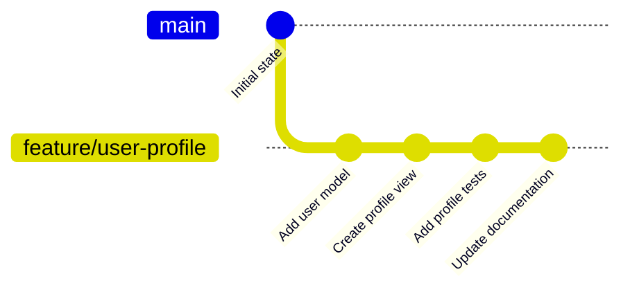

**When to Commit:**
- ✅ After completing a logical unit of work
- ✅ Before starting a different task
- ✅ When all tests pass
- ✅ Before lunch or end of day

**When NOT to Commit:**
- ❌ Code doesn't compile/run
- ❌ Tests are failing
- ❌ Mixed unrelated changes
- ❌ Contains sensitive data

## Step 3: Sharing Your Work

Once you've made commits locally, it's time to share them with your team.

### Understanding Remote Branches

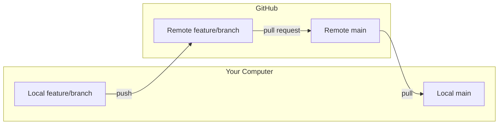

### Push to Remote

Pushing uploads your commits from your local branch to GitHub.

=== "GitHub Desktop"
    
    **First Push (Publish Branch):**
    1. Look for "Publish branch" button
    2. Click to create branch on GitHub
    3. All local commits are pushed
    
    **Subsequent Pushes:**
    1. "Push origin" button shows commit count
    2. Click to upload new commits
    3. Progress bar shows upload
    
    **Push Indicators:**
    - "0 behind, 3 ahead" = 3 commits to push
    - "Up to date" = nothing to push
    - ⚠️ Orange icon = need to pull first

=== "Command Line"
    
    ```bash
    # First push (set upstream)
    git push -u origin feature/user-profile
    
    # Subsequent pushes
    git push
    
    # See what will be pushed
    git log origin/feature/user-profile..HEAD
    
    # Force push (use with caution!)
    git push --force-with-lease
    ```
    
    **Push Scenarios:**
    ```bash
    # Push specific branch
    git push origin feature/user-profile
    
    # Push all branches
    git push --all
    
    # Push with tags
    git push --follow-tags
    ```

=== "VS Code"
    
    **First Push:**
    1. Click cloud icon in status bar
    2. Or Sync button (circular arrows)
    3. Confirm "Publish Branch" dialog
    
    **Regular Push:**
    - Click sync button
    - Shows count of commits to push/pull
    - Auto-syncs if enabled
    
    **Manual Control:**
    - "..." menu → Push
    - Push to... for specific remote

### Create Pull Request

A Pull Request (PR) is your way of proposing changes to the main branch. It's where code review happens.

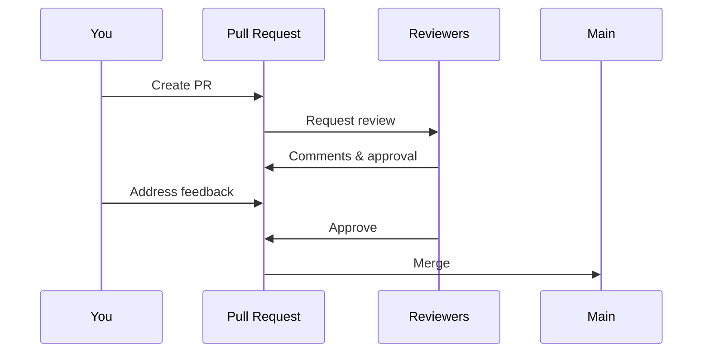

=== "GitHub Desktop"
    
    1. After pushing, click "Create Pull Request"
    2. Opens GitHub in browser
    3. Fill in the PR template:
       
       **Title**: Clear, descriptive summary
       - ✅ "Add user profile management features"
       - ❌ "Fixed stuff"
       
       **Description**:
       ```markdown
       ## Summary
       Brief description of changes
       
       ## Changes Made
       - Added user profile model
       - Created profile edit view
       - Added validation for email
       
       ## Testing
       - [x] Unit tests pass
       - [x] Manual testing completed
       - [x] Documentation updated
       
       ## Screenshots
       [If applicable]
       
       Closes #123
       ```
    
    4. Select reviewers (if you have permission)
    5. Add labels (bug, feature, etc.)
    6. Click "Create pull request"

=== "Command Line"
    
    ```bash
    # Using GitHub CLI
    gh pr create \
      --title "Add user profile management" \
      --body "Description of changes" \
      --reviewer teammate1,teammate2 \
      --label "feature,needs-review"
    
    # Interactive mode
    gh pr create
    # Opens editor for title and description
    
    # Create draft PR
    gh pr create --draft
    
    # Create and open in browser
    gh pr create --web
    ```
    
    **Without GitHub CLI:**
    1. Push your branch
    2. Visit repository on GitHub
    3. Click "Compare & pull request"
    4. Fill in details manually

=== "VS Code"
    
    **With GitHub Pull Requests Extension:**
    
    1. Open GitHub panel (GitHub icon in sidebar)
    2. Click "Create Pull Request"
    3. Fill in title and description
    4. Select:
       - Base branch (usually main)
       - Reviewers
       - Labels
       - Milestone
    5. Create as ready or draft
    
    **Features:**
    - Preview PR without creating
    - Convert to draft/ready
    - Add reviewers inline
    - Link issues automatically

### Pull Request Best Practices

**Good PR Characteristics:**
- 🎯 Focused on one feature/fix
- 📝 Clear, descriptive title
- 📋 Detailed description
- ✅ All tests passing
- 📸 Screenshots for UI changes
- 🔗 Links to related issues
- 📚 Documentation updated

**PR Description Template:**
```markdown
## What does this PR do?
Brief summary of changes and why they're needed.

## How to test
1. Step-by-step instructions
2. Expected results
3. Edge cases to check

## Checklist
- [ ] Tests added/updated
- [ ] Documentation updated
- [ ] No console.logs or debug code
- [ ] Follows code style guidelines

## Related Issues
Fixes #123
Relates to #456
```

## Step 4: Collaboration

The collaboration phase is where your changes are reviewed, improved, and eventually merged into the main branch.

### Code Review Process

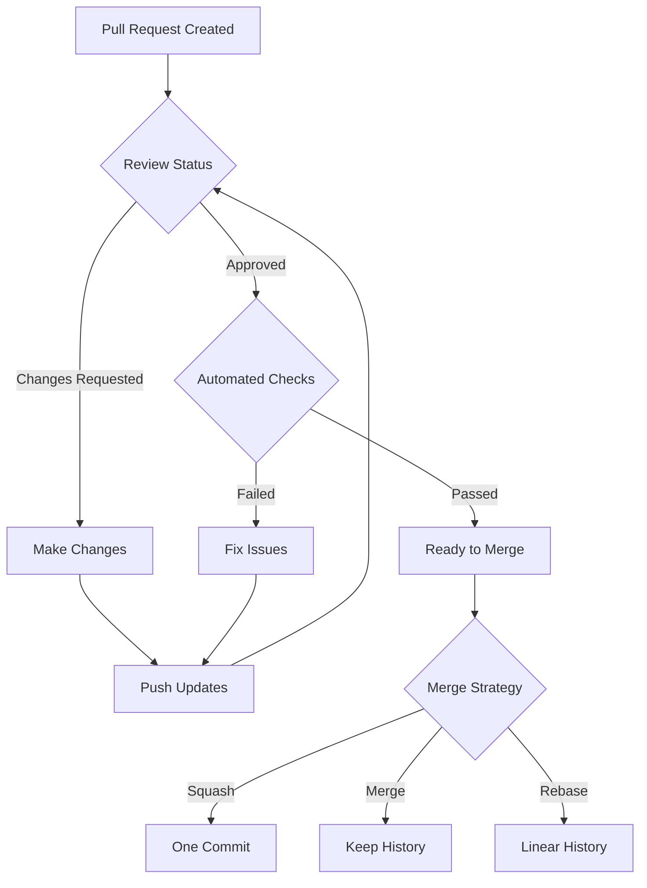

### Responding to Review Feedback

Code review is a collaborative process to improve code quality. Here's how to handle feedback effectively.

=== "GitHub Desktop"
    
    **Viewing Feedback:**
    1. Click on "Pull Requests" tab
    2. Select your PR
    3. Read comments and suggestions
    
    **Making Changes:**
    1. Return to your branch
    2. Make requested changes
    3. Commit with clear message:
       - "Address review: Add input validation"
       - "Fix: Handle edge case for empty array"
    4. Push changes
    
    **Responding:**
    - Visit PR on GitHub
    - Reply to specific comments
    - Mark as resolved when fixed

=== "Command Line"
    
    ```bash
    # Check out your PR branch
    git checkout feature/user-profile
    
    # Make requested changes
    # ... edit files ...
    
    # Commit the fixes
    git add .
    git commit -m "Address review feedback: Add error handling"
    
    # Push updates
    git push
    
    # View PR status
    gh pr view
    
    # View comments
    gh pr review
    ```
    
    **Updating commits:**
    ```bash
    # Squash fix commits before merge
    git rebase -i HEAD~3
    # Mark commits as 'squash' or 'fixup'
    
    # Force push (coordinate with team)
    git push --force-with-lease
    ```

=== "VS Code"
    
    **GitHub PR Extension:**
    1. Open GitHub panel
    2. Find your PR under "Pull Requests"
    3. View comments inline in code
    4. Make changes directly
    5. Commit and push
    
    **Features:**
    - See comments in editor
    - Reply from VS Code
    - Suggest changes
    - Apply suggestions with one click

### Handling Merge Conflicts

Conflicts happen when two branches modify the same part of a file differently.

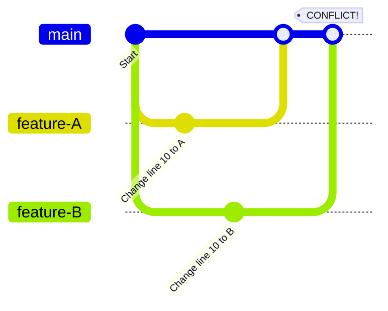

=== "GitHub Desktop"
    
    **When Conflicts Occur:**
    1. Dialog appears: "Conflicts found"
    2. Click "View conflicts"
    3. For each file:
       - Shows conflicting sections
       - Choose version to keep
       - Or open in editor to merge manually
    
    **Manual Resolution:**
    1. Open in editor
    2. Look for conflict markers:
       ```
       <<<<<<< HEAD
       Your changes
       =======
       Their changes
       >>>>>>> main
       ```
    3. Edit to final version
    4. Remove all markers
    5. Mark as resolved
    6. Commit the resolution

=== "Command Line"
    
    ```bash
    # Update your branch with main
    git checkout feature/user-profile
    git pull origin main
    
    # If conflicts occur
    # See conflicted files
    git status
    
    # Open and edit each file
    # Look for <<<<<<< markers
    
    # After fixing, add resolved files
    git add src/conflicted_file.py
    
    # Complete the merge
    git commit -m "Merge main and resolve conflicts"
    
    # Push resolved branch
    git push
    ```
    
    **Conflict Prevention:**
    ```bash
    # Regularly sync with main
    git checkout main
    git pull
    git checkout feature/user-profile
    git merge main
    ```

=== "VS Code"
    
    **VS Code Conflict Resolution:**
    1. Conflicted files marked with "C"
    2. Open file to see conflict
    3. Options appear above conflict:
       - Accept Current Change (yours)
       - Accept Incoming Change (theirs)  
       - Accept Both Changes
       - Compare Changes
    4. Click preferred option
    5. Or edit manually
    6. Save and stage file
    
    **3-Way Merge Editor:**
    - Shows your changes, their changes, and result
    - Edit result directly
    - Visual merge assistance

### Merging Your Pull Request

Once approved and all checks pass, it's time to merge your changes.

**Merge Strategies:**

1. **Merge Commit** - Preserves all history
   ```
   main ──●──●──────●──●
          \      /
   feature  ●──●──●
   ```

2. **Squash and Merge** - Combines all commits into one
   ```
   main ──●──●──●
              └─ All feature commits squashed
   ```

3. **Rebase and Merge** - Linear history
   ```
   main ──●──●──●──●──●
                 └─ Feature commits replayed
   ```

=== "GitHub Web Interface"
    
    1. All checks must be green ✅
    2. Required approvals received
    3. Click "Merge pull request" button
    4. Choose merge strategy:
       - **Squash** for feature branches
       - **Merge** for release branches
       - **Rebase** for single commits
    5. Edit commit message if needed
    6. Click "Confirm merge"
    7. Delete branch (recommended)

=== "Command Line"
    
    ```bash
    # Merge via GitHub CLI
    gh pr merge --squash --delete-branch
    
    # Or specific PR number
    gh pr merge 123 --squash
    
    # Manual merge (if you have permission)
    git checkout main
    git pull origin main
    git merge --squash feature/user-profile
    git commit -m "feat: Add user profile (#123)"
    git push origin main
    ```

=== "VS Code"
    
    **From GitHub PR Extension:**
    1. Open PR in GitHub panel
    2. Check all requirements met
    3. Click "Merge Pull Request"
    4. Select merge method
    5. Confirm merge
    6. Option to delete branch

### Post-Merge Cleanup

After merging, clean up to keep your repository tidy.

```bash
# Delete local feature branch
git checkout main
git branch -d feature/user-profile

# Delete remote branch (if not auto-deleted)
git push origin --delete feature/user-profile

# Prune deleted remote branches
git remote prune origin

# Update your local main
git pull origin main
```

## Step 5: Common Scenarios

Real-world workflows for typical development tasks.

### Scenario: Bug Fix Workflow

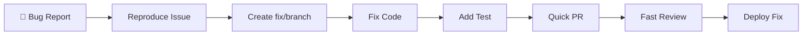

**Quick Bug Fix Process:**
```bash
# 1. Start from updated main
git checkout main && git pull

# 2. Create fix branch
git checkout -b fix/login-crash

# 3. Fix the bug and add test
# ... make changes ...

# 4. Commit with clear message
git add -A
git commit -m "fix: Prevent crash when email is null

- Add null check before accessing email property
- Add unit test for null email case
- Fixes #789"

# 5. Push and create PR
git push -u origin fix/login-crash
gh pr create --title "Fix login crash for null email" --label "bug,high-priority"
```

### Scenario: Feature Development

**Long-Running Feature Branch:**

```bash
# Regular sync pattern
git checkout main
git pull origin main
git checkout feature/big-feature
git merge main
# Resolve any conflicts
git push
```

**Breaking Down Large Features:**
```
feature/user-system
├── feature/user-model
├── feature/user-api
├── feature/user-ui
└── feature/user-tests
```

### Scenario: Documentation Update

```bash
# Quick doc fix
git checkout -b docs/fix-typo
# Edit README.md
git add README.md
git commit -m "docs: Fix installation command typo"
git push -u origin docs/fix-typo
# Create PR with "documentation" label
```

### Scenario: Emergency Hotfix

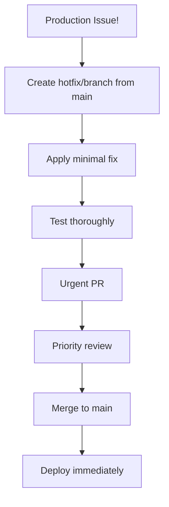

## Workflow Tips & Tricks

### Daily Workflow Checklist

**Morning Routine:**
- [ ] Pull latest main
- [ ] Check PR status
- [ ] Review team PRs
- [ ] Plan today's work

**Before Each Commit:**
- [ ] Run tests locally
- [ ] Review changes
- [ ] Check for debug code
- [ ] Write clear message

**End of Day:**
- [ ] Push all commits
- [ ] Update PR description
- [ ] Note tomorrow's tasks
- [ ] Clean up branches

### Productivity Tips

1. **Commit Often**
   - Easier to revert
   - Better history
   - Less merge conflicts

2. **Use Branch Protection**
   - Require PR reviews
   - Run automated tests
   - Prevent direct pushes

3. **Automate Checks**
   - Pre-commit hooks
   - CI/CD pipelines
   - Linting and formatting

4. **Communicate**
   - Update PR descriptions
   - Respond to reviews promptly
   - Ask for help when stuck

## Next Steps

Now that you understand the complete workflow, it's time to practice with real exercises!

Continue to [Practice Exercises](practice.md) to apply these workflows →

---

*Remember: The best way to learn Git workflows is by doing. Start with small changes and gradually take on larger features as you build confidence.*